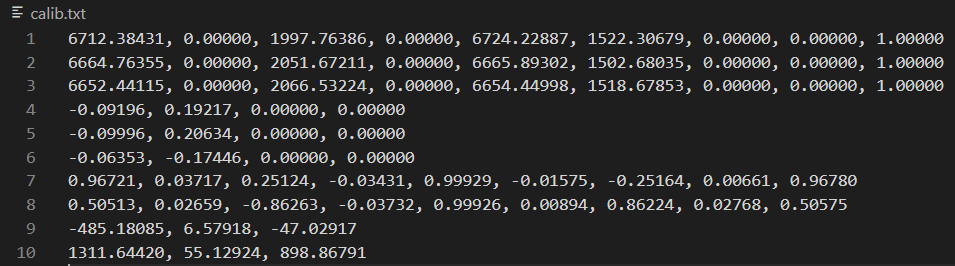

# fruitfly
果蝇轨迹重建相关程序

## 1. calib.py

将选好的成组标定图像（cam1、cam2、cam3文件夹，10~20三元组最佳）保存到dataPath文件夹，则calib.py脚本可以同时完成单目和立体标定。

**输入：**路径`dataPath`

**输出：**`calib.txt`，如下图所示，第1-3行分别为相机1-3的内参矩阵，4-6行为它们的畸变系数（k1, k2, p1, p2，见附录），7、8行为相机21和相机23见的旋转矩阵，7、8行为平移向量。

